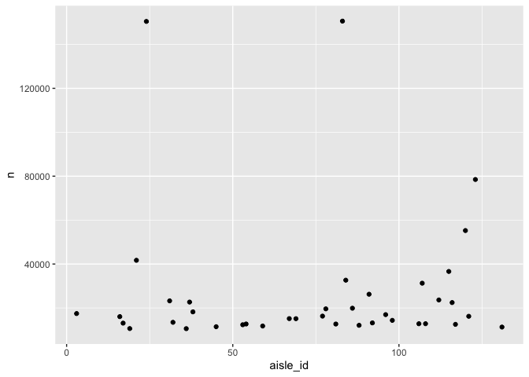
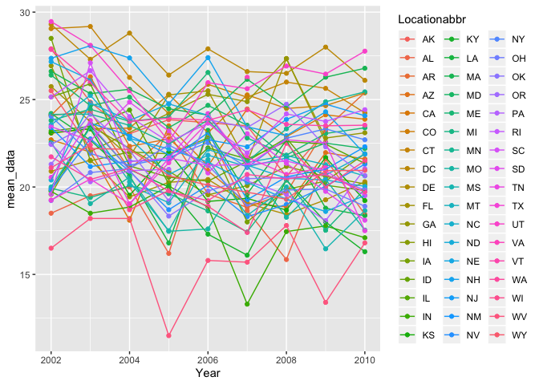
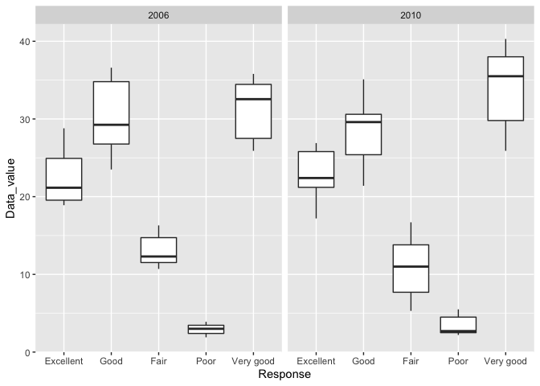
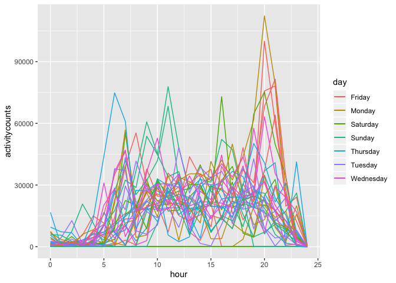

p8105\_hw3\_wz2506
================
Weiran Zhang
10/11/2019

\#\#Problem 1

``` r
library(p8105.datasets)
data("instacart") ##Load data instacart
```

``` r
##How many aisle in total
max(pull(instacart, aisle_id))
```

    ## [1] 134

``` r
min(pull(instacart, aisle_id))
```

    ## [1] 1

``` r
##wrangle the table to aisle_id and number of items ordered from each aisle
instacart = instacart %>%
  group_by(aisle_id) %>%
  summarize(n = n())
```

`Range of aisle_id is from 1 to 134, so there are 134 aisles in
total.`

``` r
##dataset of aisle_id and number of items ordered from the aisles over 10000 to check for the aisle with the most items ordered from
instacart %>%
  mutate(
    large = case_when(
      n > 10000 ~ "large",
      n <= 10000 ~ "not_large",
      TRUE     ~ ""
    )) %>%
  filter(large == "large") %>%
  group_by(aisle_id, large)
```

    ## # A tibble: 39 x 3
    ## # Groups:   aisle_id, large [39]
    ##    aisle_id      n large
    ##       <int>  <int> <chr>
    ##  1        3  17449 large
    ##  2       16  16052 large
    ##  3       17  13088 large
    ##  4       19  10620 large
    ##  5       21  41699 large
    ##  6       24 150473 large
    ##  7       31  23228 large
    ##  8       32  13460 large
    ##  9       36  10575 large
    ## 10       37  22676 large
    ## # … with 29 more rows

``` r
##plot of number of items ordered from each aisle for items number over 10000
instacart %>%
  mutate(
    large = case_when(
      n > 10000 ~ "large",
      n <= 10000 ~ "not_large",
      TRUE     ~ ""
    )) %>%
  filter(large == "large") %>%
  group_by(aisle_id, large) %>%
  ggplot(aes(x = aisle_id, y = n)) +
  geom_point()
```

<!-- -->

`From the dataset of aisle_id and number of items over 10000, we can see
that the aisle with aisle_id = 83 is the aisle with most items oredered
from.`

``` r
##Table of three most popular items in the three specific aisles
library(p8105.datasets)
data("instacart")
instacart %>%
  filter(aisle %in% c("baking ingredients", "dog food care", "packaged vegetables fruits")) %>%
  group_by(aisle, product_name) %>%
  summarize(n = n()) %>%
  filter(min_rank(desc(n)) < 4 )%>%
  knitr::kable(digits = 1)
```

| aisle                      | product\_name                                 |    n |
| :------------------------- | :-------------------------------------------- | ---: |
| baking ingredients         | Cane Sugar                                    |  336 |
| baking ingredients         | Light Brown Sugar                             |  499 |
| baking ingredients         | Pure Baking Soda                              |  387 |
| dog food care              | Organix Chicken & Brown Rice Recipe           |   28 |
| dog food care              | Small Dog Biscuits                            |   26 |
| dog food care              | Snack Sticks Chicken & Rice Recipe Dog Treats |   30 |
| packaged vegetables fruits | Organic Baby Spinach                          | 9784 |
| packaged vegetables fruits | Organic Blueberries                           | 4966 |
| packaged vegetables fruits | Organic Raspberries                           | 5546 |

`So the three most popular items in aisle of baking ingredient are cane
sugar(336), light brown sugar(499) and pure baking soda(387), in aisle
of dog food care are organix chicken & brown rice recipe(28), small dog
biscuits and snack sticks chicken(26) & rice recipe dog(30), in aisle
packaged vegetables fruits are organic baby spinach(9784), organic
blueberries(4966) and organic raspberries(5546).`

``` r
##Table of mean hour of day
library(p8105.datasets)
data("instacart")
instacart %>%
  filter(product_name %in% c("Pink Lady Apples", "Coffee Ice Cream")) %>%
  mutate(order_dow = replace(order_dow, order_dow == '0', 'Sunday'),
         order_dow = replace(order_dow, order_dow == '1', 'Monday'),
         order_dow = replace(order_dow, order_dow == '2', 'Tuesday'),
         order_dow = replace(order_dow, order_dow == '3', 'Wednesday'),
         order_dow = replace(order_dow, order_dow == '4', 'Thursday'),
         order_dow = replace(order_dow, order_dow == '5', 'Friday'),
         order_dow = replace(order_dow, order_dow == '6', 'Saturnday'),
  ) %>%
  group_by(product_name, order_dow) %>%
  summarize(meanhour = mean(order_hour_of_day)) %>%
  pivot_wider(
    id_cols = c(product_name, order_dow, meanhour),
    names_from = order_dow,
    values_from = meanhour) %>%
  knitr::kable(digits = 1)
```

| product\_name    | Friday | Monday | Saturnday | Sunday | Thursday | Tuesday | Wednesday |
| :--------------- | -----: | -----: | --------: | -----: | -------: | ------: | --------: |
| Coffee Ice Cream |   12.3 |   14.3 |      13.8 |   13.8 |     15.2 |    15.4 |      15.3 |
| Pink Lady Apples |   12.8 |   11.4 |      11.9 |   13.4 |     11.6 |    11.7 |      14.2 |

`So from the table of mean hour of order, we can see that Wednesday it
tooks longer to order for both Coffee ice Cream and Pink Lady Apples.
But the mean hours are all about between 11-15 hours.`

`There are 15 variables in this instacart dataset and 1384617
observations in total. Key variables including aisle wich represents the
products types aisle contains, aisle_id which are the id number of
aisle, product_name which is the product name, order_dow whic are the
day of a week items ordered, order_hour_of_day which are average number
of hours ordered in a day.`

\#\#Problem 2

``` r
##Load BRFSS dataset
library(p8105.datasets)
data("brfss_smart2010")
```

``` r
##Data cleaning following the instructions
tidy_data = brfss_smart2010 %>%
  filter(Topic == "Overall Health", 
         Response %in% c("Excellent", "Very good", "Good", "Fair", "Poor")) %>% ##focus only on "Overall Health" topic and the five response types
  select(state = Locationabbr, location = Locationdesc, everything()) %>% ##change to reasonable names
  mutate(Response = as.factor(Response)) %>% ##taking the response as factor variable
  mutate(Response = forcats::fct_relevel(Response, c("Excellent","Very Good","Good","Fair","Poor"))) %>%
  arrange(Response)
```

    ## Warning: Unknown levels in `f`: Very Good

``` r
##states that observed at 7 or more locations in year 2002
brfss_smart2010 %>%
  filter(Topic == "Overall Health", 
         Response %in% c("Excellent", "Very good", "Good", "Fair", "Poor"), 
         Year == "2002") %>%
  group_by(Locationdesc) %>%
  summarize(n = n()) %>%
  separate(Locationdesc, c("state","county"), sep = "-") %>%
  group_by(state) %>%
  summarize(n = n()) %>%
  mutate(
    observed = case_when(
      n >= 7 ~ "observed",
      n < 7 ~ "not_observed",
      TRUE     ~ ""
    )) %>%
  filter(observed == "observed") %>%
  group_by(observed)
```

    ## Warning: Expected 2 pieces. Additional pieces discarded in 1 rows [25].

    ## # A tibble: 6 x 3
    ## # Groups:   observed [1]
    ##   state     n observed
    ##   <chr> <int> <chr>   
    ## 1 "CT "     7 observed
    ## 2 "FL "     7 observed
    ## 3 "MA "     8 observed
    ## 4 "NC "     7 observed
    ## 5 "NJ "     8 observed
    ## 6 "PA "    10 observed

``` r
##states that observed at 7 or more locations in year 2010
brfss_smart2010 %>%
  filter(Topic == "Overall Health", 
         Response %in% c("Excellent", "Very good", "Good", "Fair", "Poor"), 
         Year == "2010") %>%
  group_by(Locationdesc) %>%
  summarize(n = n()) %>%
  separate(Locationdesc, c("state","county"), sep = "-") %>%
  group_by(state) %>%
  summarize(n = n()) %>%
  mutate(
    observed = case_when(
      n >= 7 ~ "observed",
      n < 7 ~ "not_observed",
      TRUE     ~ ""
    )) %>%
  filter(observed == "observed") %>%
  group_by(observed)
```

    ## Warning: Expected 2 pieces. Additional pieces discarded in 1 rows [63].

    ## # A tibble: 14 x 3
    ## # Groups:   observed [1]
    ##    state     n observed
    ##    <chr> <int> <chr>   
    ##  1 "CA "    12 observed
    ##  2 "CO "     7 observed
    ##  3 "FL "    41 observed
    ##  4 "MA "     9 observed
    ##  5 "MD "    12 observed
    ##  6 "NC "    12 observed
    ##  7 "NE "    10 observed
    ##  8 "NJ "    19 observed
    ##  9 "NY "     9 observed
    ## 10 "OH "     8 observed
    ## 11 "PA "     7 observed
    ## 12 "SC "     7 observed
    ## 13 "TX "    16 observed
    ## 14 "WA "    10 observed

`There are 6 states that are observed for more than 7 times in 2002,
and 14 states observed for more than 7 times in 2010.`

``` r
##“spaghetti” plot
brfss_smart2010 %>%
  select(Year, Response, Locationabbr, Data_value) %>%
  filter(Response == "Excellent") %>%
  group_by(Locationabbr, Year) %>%
  summarize(mean_data = mean(Data_value)) %>%
  ggplot(aes(x = Year, y = mean_data, color = Locationabbr)) +
  geom_point() + geom_line() 
```

    ## Warning: Removed 4 rows containing missing values (geom_point).

    ## Warning: Removed 3 rows containing missing values (geom_path).

<!-- -->

`From the plot, we can see that all states from 2002 to 2010 have the
mean data value between 0 to 30, and the data are distributed relatively
concentrated between 20 to 30 with few outliers.`

``` r
##Two-panel plots showing distribution of data_value
tidy_data %>%
  filter(Year %in% c(2006, 2010), 
         state == "NY") %>%
  ggplot(aes(x = Response, y = Data_value)) +
  geom_boxplot() + 
  facet_grid(~Year) +
  viridis::scale_fill_viridis(discrete = TRUE)
```

<!-- -->

`We can see from the two-panel plot that the number of each
response(excellent, very good, good, fair and poor) are all distributed
in the similar place when comapring 2006 data with 2010 data. and the
distributions of each responses in 2006 to 2010 are pretty much all not
normal.`

\#\#Problem 3

``` r
##Load and tidy accel dataset
accel = read_csv(file = "/Users/weiranzhang/p8105_hw3_wz2506/accel_data.csv") %>%
  mutate(weekday_vs_weekend =
           ifelse(day %in% c("Saturnday","Sunday"), "Weekend", "Weekday"))
```

    ## Parsed with column specification:
    ## cols(
    ##   .default = col_double(),
    ##   day = col_character()
    ## )

    ## See spec(...) for full column specifications.

`The first three variables are week number(week), day number(day_id) and
day of a week(day) with the additional variable weekday vs. weekend
shows whether it is a weekday ot weekend. There are 1440 columns of
activity data value recording by each minute in a day. And there are
total 35 observations representing 35 days of observation period.`

``` r
##Total activity variable aggregate across minute
sum = accel %>%
  mutate(Total = rowSums(accel[,4:1443])) %>%
  select(week, day_id, day, Total)
```

`There is no apperant trands in the total number of activity data value
by day from those 35 days. But we can see that most total activity data
values are all over 300000 with few outliers on Week 1 Monday, Week 4
Saturnday and Week 5 Saturnday.`

``` r
##single-panel plot of 24-hour activity vs. time
databyhour = accel %>%
  pivot_longer(
    activity.1:activity.1440,
    names_to = "minute",
    names_prefix = "activity.",
    values_to = "activity"
  ) %>%
  mutate(minute = as.numeric(minute),
         hour = minute %/% 60) %>%
  group_by(day, hour, week) %>%
  summarize(activitycounts = sum(activity)) 

week1 = databyhour %>%
  filter(week == 1)

week2 = databyhour %>%
  filter(week == 2)

week3 = databyhour %>%
  filter(week == 3)

week4 = databyhour %>%
  filter(week == 4)

week5 = databyhour %>%
  filter(week == 5)

  ggplot() +
  geom_line(week1, mapping = aes(x = hour, y = activitycounts, color = day)) + geom_line(week2, mapping = aes(x = hour, y = activitycounts, color = day)) + geom_line(week3, mapping = aes(x = hour, y = activitycounts, color = day)) + geom_line(week4, mapping = aes(x = hour, y = activitycounts, color = day)) + geom_line(week5, mapping = aes(x = hour, y = activitycounts, color = day)) 
```

<!-- -->

`There are four obvious peaks in the plot which we can see are around
hour 5, 10, 15 and 20, and the max happens at around hour 20 which we
can see by color is a Monday. And for three other smaller peaks are all
happens at different day of a week. But overall, there is no obvious
pattern for the activity data value we can see from this plot. And the
most concentrated part of activity values are between 1500-4500.`
